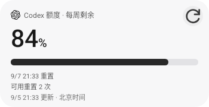
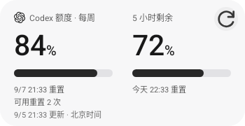

# 余量 · Quotile

**把 Codex 额度放到 Android 桌面，看一眼，就知道还剩多少。**

A small, native Android home-screen widget for Codex quota. On-device sign-in, one-tap refresh, and optional scheduled updates.

[下载 APK · 0.3.4](downloads/Quotile-0.3.4.apk?raw=true) · [完整下载包](downloads/Quotile-0.3.4.zip?raw=true) · [使用指南](docs/USAGE.md) · [隐私说明](PRIVACY.md) · [开发与构建](docs/DEVELOPMENT.md)

Quotile = **Quota + Tile**，中文名「余量」。项目从 Galaxy Z Fold7 的桌面需求出发，重点适配 **1×5、2×5** 及内外屏缩放；支持 Android 12 及以上。登录、存储和额度读取都在手机上完成，无需电脑、服务器、Termux 或 API Key。

**本程序全部由 GPT-6 Astra 完成，MicH 提出需求并进行实机测试与反馈。**

## 看看它的样子

以下为 **0.3.4 原生 Android 控件渲染图，使用合成示例数据**，不代表真实账户额度。实际占格和文字大小取决于启动器、桌面网格与系统缩放。

### 1×5 · 紧凑卡片

### 2×5 · 每周详情

### 2×5 · 每周与 5 小时

## 可以做什么

| 功能 | 具体表现 |
| --- | --- |
| 查看 Codex 余量 | 显示每周剩余百分比、胶囊进度条和重置时间；接口提供 5 小时额度且宽度足够时，详细卡片自动显示双栏。 |
| 查看可用重置次数 | 两行及以上卡片在重置时间下方显示「可用重置 N 次」。这是账户共用的次数，只展示，不执行重置。 |
| 在桌面直接刷新 | 点右侧刷新按钮，在当前桌面完成读取和更新，不打开应用窗口；点卡片其余区域可进入设置。 |
| 自己决定刷新频率 | 默认只手动刷新。可开启约每 15／30／60 分钟自动刷新，并随时关闭。 |
| 调整大小与外观 | 支持横向、纵向缩放；浅色、深色、跟随系统三种外观。原生文字、进度条与矢量图标保持清晰。 |
| 手机本地登录 | 支持设备码及浏览器 OAuth 登录，凭据通过 Android Keystore 加密保存在本机。 |
| 识别旧数据 | 刷新失败保留上次结果并标明状态；不猜测余量，也不在重置时间到达后自行填成 100%。 |
| 先试外观 | 演示模式无需真实额度，桌面会明确标注「演示」。 |

尺寸在本项目中统一写作 **高 × 宽**，因此 1×5 / 2×5 在部分启动器中会显示为 5×1 / 5×2。详细布局按启动器提供的实际高度判断（≥110dp），而非单纯按占格名称判断。

## 安装与快速开始

1. 在 Android 12 及以上手机上[下载 Quotile-0.3.4.apk](downloads/Quotile-0.3.4.apk?raw=true)，按系统提示安装，打开「余量」。
2. 首次登录建议使用 **「设备码登录 · 网页卡住时使用」**，按照提示在 OpenAI 官方页面完成授权，再返回应用。若账户未开放设备码登录，可使用「登录 ChatGPT」的浏览器方式。详见[登录步骤](docs/USAGE.md#首次登录)。
3. 点击 **「刷新额度」**，读取第一份数据。登录成功和打开应用本身都不会主动查询额度。
4. 点击 **「添加 1 × 5」或「添加 2 × 5」**，确认放到桌面；长按小组件，拖动边缘调整大小。
5. 以后点击小组件右侧的刷新按钮即可。需要定时更新时，再到设置中开启「自动刷新」。

当前为社区预览版本。下载链接提供的是沿用固定签名的交付 APK；[完整下载包](downloads/Quotile-0.3.4.zip?raw=true) 同时包含许可和第三方说明。从本项目同签名的 0.3.0–0.3.3 可直接覆盖升级；0.2.0 需要先卸载再安装。**GitHub Actions 中的调试 APK 使用不同签名，请不要与交付 APK 混装。** [升级说明与校验值](docs/USAGE.md#安装与升级)

## 数据与兼容范围

- **这里显示的是 Codex 额度**，不等同于所有 ChatGPT 对话、模型或工具的独立限额，也不显示 API 计费余额。
- 可用重置次数取自额度响应中的可选字段 `rate_limit_reset_credits.available_count`，与额度同次刷新，不增加额外查询。明确返回 0 才显示「0 次」；缺失或异常时显示「—」，不会按套餐推算。
- 时间统一显示为 **北京时间（UTC+8）**。更新时间是最近一次成功读取的时间，不代表实时推送。
- 自动刷新由 Android 系统安排，休眠、省电或网络状况可能延迟执行。关闭后取消定时任务；没有常驻服务。
- 当前重点实测设备为 **Galaxy Z Fold7**。其他 Android 12+ 设备可尝试使用，但启动器布局、账号权限和登录兼容性仍需实际验证。
- 应用参考公开的 Codex 客户端协议实现。第三方客户端登录及后端接口可能随上游变化，需要后续更新；不承诺永久兼容。

应用不会读取 ChatGPT App 的私有文件，不要求 Root，不收集账户密码，也不把登录凭据上传到本项目服务器或 GitHub。具体网络请求、保存的数据与清除方式见[隐私说明](PRIVACY.md)。

## 开发与验证

主要代码位于 [`android/`](android/)，构建和校验脚本位于 [`tools/`](tools/)。环境为 JDK 17、Gradle 8.11.1、AGP 8.10.1、Android SDK 36；完整步骤见[开发文档](docs/DEVELOPMENT.md)。

[0.3.4 的 GitHub Actions 构建与 Android 16 检查已通过](https://github.com/MicHrrrD/quotile/actions/runs/33969014129)，覆盖额度与次数解析、本地快照、手动刷新、自动任务控制，以及多尺寸、主题和字体缩放下的原生布局。测试使用合成数据；可选字段是否对某个真实账户开放，以该账户刷新结果为准。详细记录见 [`VALIDATION.md`](VALIDATION.md)。

欢迎通过 [Issues](https://github.com/MicHrrrD/quotile/issues) 反馈问题或建议。请附上机型、Android／One UI 版本、应用版本和复现步骤；截图前遮住账号信息，**不要提交验证码、令牌、Cookie 或签名私钥**。

仓库中的 [`bridge/`](bridge/) 是早期 0.1.0 的历史实现，当前手机版本不依赖它。

## 许可与致谢

本项目采用 **Apache-2.0** 许可证，全文见 [`LICENSE`](LICENSE)；上游代码与图标来源见 [`THIRD_PARTY_NOTICES.md`](THIRD_PARTY_NOTICES.md)。

Quotile 是独立项目，与 OpenAI 或三星没有官方隶属关系。OpenAI、ChatGPT、Codex 及相关标志属于各自权利人；小组件中的标志用于说明额度来源。
